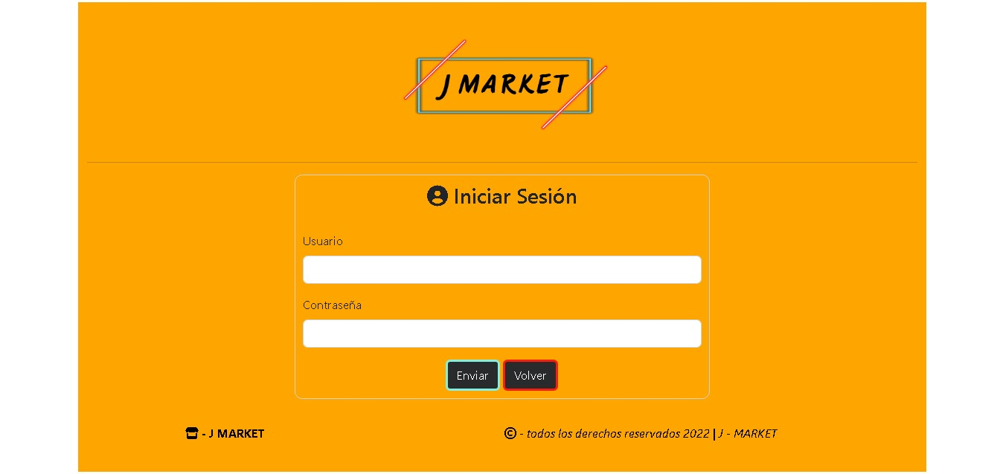
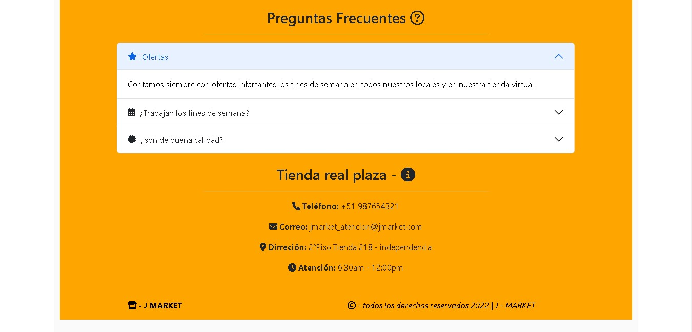

# tienda-con-boostrap-fontawesome
 
## **Pagina ecommerce con iconos de fontawesome**
[Ver demo ->](https://github.com/jefersc/paginaweb-con-bootstrap-fontawesome.git)

## **Paginas Principales:**

 
<h1 align="center"><strong> 🚀 Inicio:</strong></h1>
 

 
<h2 align="center"><strong> 🛒 Abarrotes:</strong></h2>
 

 
<h2 align="center"><strong> 🤔 Opiniones:</strong></h2>
 

 
<h2 align="center"><strong> 👤 Logearse:</strong></h2>
 

 
<h2 align="center"><strong> 🕳️ Footer:</strong></h2>
 

  

